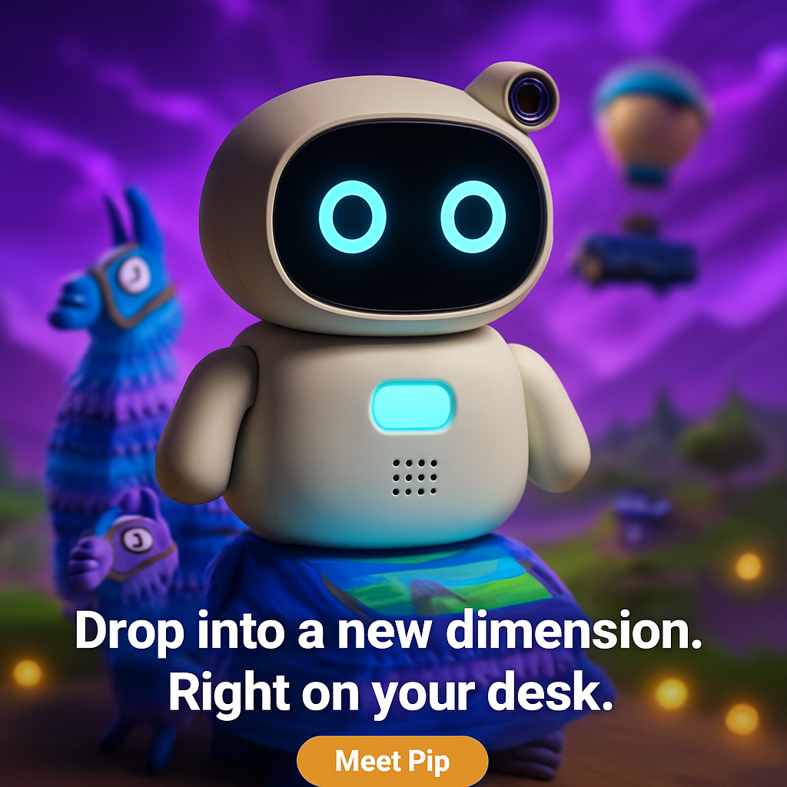

# Creative Automation Pipeline

Automated social ad creative generation using OpenAI `gpt-image-1`. Accepts a campaign brief, generates hyper-realistic product photography placed inside game worlds with cinematic bokeh, and produces creatives across three aspect ratios. Ships with both a web UI and a CLI.


---

## Quick Start

### 1. Clone

```bash
git clone https://github.com/0xaiwhisperer/creative-automation-pipeline.git
cd creative-automation-pipeline
```

### 2. Install dependencies

```bash
pip install -r requirements.txt
```

Requires **Python 3.9+**.

### 3. Add your OpenAI API key

```bash
# Windows
copy .env.example .env

# macOS / Linux
cp .env.example .env
```

Open `.env` and set your key:

```
OPENAI_API_KEY=sk-...
```

> `gpt-image-1` requires your OpenAI organisation to complete [API verification](https://help.openai.com/en/articles/10910291-api-organization-verification) before use.

### 4. Run

**Web UI (recommended):**

```bash
python run_web.py
```

Then open **http://localhost:5000** in your browser.

**CLI:**

```bash
python pipeline.py --brief inputs/brief_gaming_gummies.json
```

---

## Project Structure

```
creative-automation-pipeline/
│
├── pipeline/                   # Core logic — importable package
│   ├── __init__.py             # Exports all public classes
│   ├── brief_loader.py         # Loads & validates JSON/YAML briefs
│   ├── asset_manager.py        # Finds existing hero images by name
│   ├── image_generator.py      # OpenAI gpt-image-1 generate + edit
│   ├── compliance.py           # Brand color check + legal word scanner
│   └── reporter.py             # Writes JSON report + console summary
│
├── web/                        # Flask web server
│   ├── app.py                  # API routes + SSE streaming + persistence
│   └── static/
│       └── index.html          # Full single-page frontend
│
├── inputs/                     # Campaign briefs and hero images
│   ├── brief.json              # Example — North America health products
│   ├── brief_apac.json         # Example — APAC skincare & wellness
│   ├── brief_gaming_gummies.json  # Example — Gaming campaign (10 worlds)
│   └── assets/                 # Drop product hero images here
│
├── outputs/                    # Generated creatives (git-ignored)
├── logs/                       # Run logs (git-ignored)
│
├── pipeline.py                 # CLI entry point
├── run_web.py                  # Web UI entry point
├── requirements.txt
├── .env.example
└── .gitignore
```

---

## Running the Web UI

```bash
python run_web.py
```

Open **http://localhost:5000**.

**What you can do:**

- Select any brief from `inputs/` — the UI auto-loads products and game themes
- Toggle individual game worlds on/off (saves API cost)
- Filter to a single product
- Enable **Simulation Mode** to test the full pipeline with placeholder images (no API calls)
- Drag-and-drop a hero image into the Asset Upload zone
- Watch creatives generate in real-time — completed games appear at the top as they finish
- Click any creative to open a full-screen lightbox and download it
- All past runs persist across restarts and appear in the sidebar history

---

## Running the CLI

```bash
# Full run — all products, all game worlds
python pipeline.py --brief inputs/brief_gaming_gummies.json

# Single product
python pipeline.py --brief inputs/brief.json --product "GreenBoost Smoothie"

# Custom output folder
python pipeline.py --brief inputs/brief.json --output my_campaign

# Dry run — placeholder images, no API calls (useful for testing)
python pipeline.py --brief inputs/brief.json --dry-run
```

**Output structure:**

```
outputs/
└── FruityBurst Gummies/
    ├── Fortnite/
    │   ├── 1x1/final.png       (1024 × 1024)
    │   ├── 9x16/final.png      (1024 × 1536)
    │   └── 16x9/final.png      (1536 × 1024)
    ├── Minecraft/
    │   └── ...
    └── campaign_report.json
```

---

## Campaign Briefs

Briefs are JSON files in `inputs/`. Minimum required fields:

| Field | Required | Description |
|---|---|---|
| `products` | ✅ | Array of product objects (at least 1) |
| `region` | ✅ | Target market |
| `target_audience` | ✅ | Audience description |
| `campaign_message` | fallback | Used if not set per-product |

### Gaming brief structure

Products can include a `gaming_themes` array to generate per-game variations:

```json
{
  "region": "North America",
  "target_audience": "Gamers aged 13-35",
  "base_art_style": { ... },
  "products": [
    {
      "name": "FruityBurst Gummies",
      "product_visual_spec": { ... },
      "gaming_themes": [
        {
          "game": "Fortnite",
          "style": "Battle royale environment with loot llama...",
          "audience": "Teen competitive gamers",
          "message": "Drop in. Snack up."
        }
      ]
    }
  ]
}
```

### Adding a product hero image

Name the file to match the product name (case-insensitive, ignoring spaces/hyphens) and drop it in `inputs/assets/`:

```
inputs/assets/fruityburst_gummies.png   ← matches "FruityBurst Gummies"
inputs/assets/greenboost_smoothie.jpg   ← matches "GreenBoost Smoothie"
```

Supported formats: `.png`, `.jpg`, `.jpeg`, `.webp`

If no asset is found, a hero image is generated via `gpt-image-1` and cached in `inputs/assets/` for future runs.

---

## How It Works

```
Campaign brief (JSON)
        │
        ├─ Load & validate brief
        │
        ├─ For each product:
        │   ├─ Find or generate hero image (gpt-image-1 images.generate)
        │   │
        │   └─ For each game theme × aspect ratio:
        │       ├─ gpt-image-1 images.edit
        │       │   · Recomposes image for target aspect ratio
        │       │   · Places product in game world with bokeh background
        │       │   · Renders campaign text natively (no PIL overlay)
        │       ├─ Brand compliance check (pixel colour sampling)
        │       └─ Legal content check (prohibited word scan)
        │
        └─ Write campaign_report.json
```

**Aspect ratios and native sizes:**

| Label | Size | Platform |
|---|---|---|
| `1x1` | 1024 × 1024 | Instagram / Facebook feed |
| `9x16` | 1024 × 1536 | Stories & Reels |
| `16x9` | 1536 × 1024 | YouTube banners / LinkedIn |

---

## API Cost Estimate

Each run makes the following OpenAI calls (at `quality="medium"`):

- **1 call** per product for hero image generation (skipped if asset already exists)
- **3 calls** per game theme × aspect ratio for image edits

For the gaming gummies brief with 10 games × 3 ratios = **30 edit calls** per product.

See [OpenAI image pricing](https://platform.openai.com/docs/pricing#image-generation) for current rates. Use `--dry-run` or Simulation Mode in the UI to test the pipeline at zero cost.

---

## Extending the Pipeline

### Add a new aspect ratio

In `pipeline/image_generator.py`, add to both dicts:

```python
ASPECT_RATIO_TO_NATIVE_SIZE["4x5"] = "1024x1280"
NATIVE_SIZE_DIMENSIONS["1024x1280"] = (1024, 1280)
```

Then add `"4x5"` to the ratios list in `pipeline.py` and `web/app.py`.

### Add a new game theme

Add an entry to the `gaming_themes` array in your brief JSON. No code changes needed.

### Swap to a different image API

Replace the methods in `pipeline/image_generator.py`. The rest of the pipeline is API-agnostic.

---

## Requirements

```
flask>=3.0.0
openai>=1.30.0
Pillow>=10.0.0
pyyaml>=6.0
python-dotenv>=1.0.0
```
